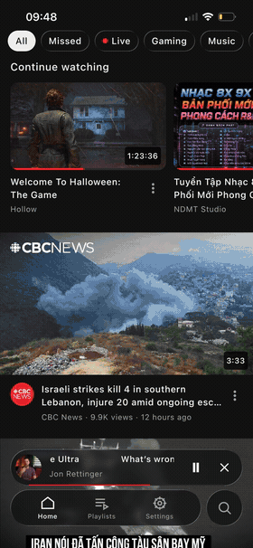
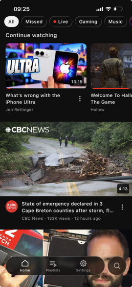
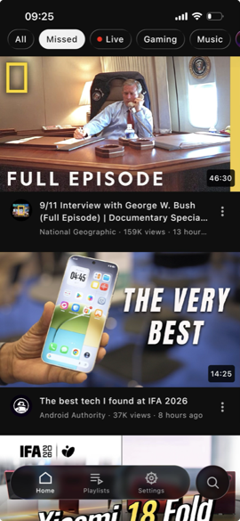
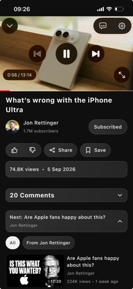
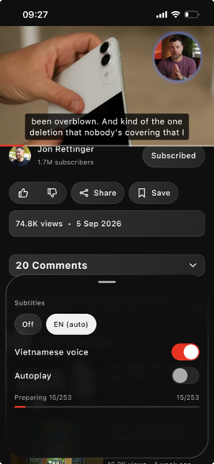
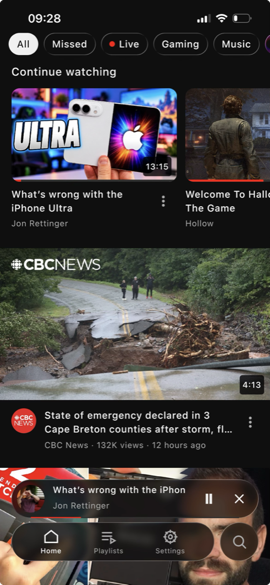
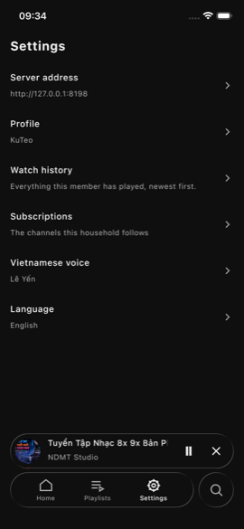

# Mytube — mobile

**English** · [Tiếng Việt](README.vi.md)

A native Android and iOS client for [Local Mytube](https://github.com/kuteo-git/Mytube),
a self-hosted media library that runs on a Mac at home.

It exists to play audio with the screen off, which a browser cannot do. The web
app is better on a desktop and stays the primary client; this is what gets used
while walking around the house with a phone in a pocket.

<p align="center">
  
</p>
<p align="center">
  <em>Recorded on an iPhone. <a href="docs/screenshots/demo.mp4">Same clip at full quality.</a></em>
</p>

<p align="center">
  
  
  
</p>
<p align="center">
  
  
  
</p>

## What it does

- **Home**, with the server's topic chips, *Continue watching*, and **Missed**,
  which is what the channels you follow posted in the last day that nobody has
  watched.
- **Watch**, with the player YouTube's own app suggests: transport controls on
  glass over the picture, a seek bar along the bottom edge, comments read-only,
  and an up-next rail that doubles as the queue.
- **Playlists**, made and edited here. The saved shelf is the first row of the
  same dialog the bookmark opens.
- **Subtitles**, side-loaded from the files beside the video.
- **Vietnamese narration**: the server reads the captions, translates them and
  speaks them; this app plays the clips over the video and ducks the original
  audio while a line is spoken. Its two levels, how loud the voice is and how far
  the video drops under it, are the viewer's, and they are separate numbers
  rather than one chained through the other.
- **Background audio**, a lock-screen entry with artwork and a working scrubber,
  and a miniplayer that crosses every screen.
- **Search**, which reaches the library *and* YouTube. Opening an upstream result
  writes its catalogue row first, so the player never lands on nothing.
- **English and Vietnamese**, chosen per device.

## What it needs

The server. This app talks to a Local Mytube gateway on the house wifi and does
nothing at all without one: there is no account, no cloud, and no copy of the
library on the phone.

- **House wifi only.** The server is LAN-only, plain HTTP, and `X-User-Id` is a
  header anyone on the network can set. That is deliberate for a household of
  five and would be indefensible anywhere else.
- **Streams only.** Nothing is downloaded to the phone, so background audio works
  around the house and not on a commute.
- The server's address is typed by hand on first run, like Home Assistant. mDNS
  dies on ordinary routers, and the Mac's address is DHCP.

## Building it

Kotlin Multiplatform with Compose Multiplatform. Everything shared except three
seams: the player, the narration player, and the background session.

```sh
source env.sh    # the toolchain lives beside the project, not in ~/.zshrc

./gradlew jvmTest \
          :composeApp:compileDebugKotlinAndroid \
          :composeApp:compileKotlinIosSimulatorArm64
```

That is the verification command, and it is short of `./gradlew check` because
`check` links a Kotlin/Native test binary, which needs full Xcode. What it
therefore does not cover is iOS linking and `iosSimulatorArm64Test`, recorded as
uncovered rather than quietly dropped.

- **Android**: `./gradlew :composeApp:assembleDebug`.
- **iOS**: `iosApp/iosApp.xcodeproj`, built against an iOS 26 SDK. The Kotlin
  framework is compiled by a build phase that sources `env.sh`. Without it the
  Xcode build fails where the terminal build succeeds, which reads as a broken
  project.

## How it is put together

```
composeApp/src/
  commonMain/  domain · data · ui — the whole app
  androidMain/ Media3/ExoPlayer, MediaSessionService
  iosMain/     AVPlayer, AVAudioSession, MPNowPlayingInfoCenter
  jvmTest/     the guards
```

Clean architecture, judged by the direction of dependencies rather than by the
number of folders: `domain` imports no Ktor, no serialization and no Compose.
Two guards in `jvmTest` fail the build when that stops being true, and both are
proven to fail. An `io.ktor` import in `domain`, and a hardcoded `"Try again"` in
a screen, each turn the build red.

A few decisions that explain most of the code:

- **No DI framework.** Constructor injection by hand from one composition root.
  A service locator's missing registration fails at runtime, which is the
  opposite of this project's habit of turning rules into compile errors.
- **The dictionary is an interface, not a key lookup.** `Strings` declares every
  word as a property, so a missing translation cannot exist: add one and every
  language stops compiling until it is supplied, with the compiler naming the
  field.
- **Nothing in `domain` or a ViewModel is nullable; DTOs are.** The wire really
  can omit a field, and absence is decided once, in the mapper, and named rather
  than implied.
- **No Compose UI tests.** Previews cover what a screen looks like, including the
  states that are hard to reach on a device, and ViewModel tests cover what it
  does.

`CLAUDE.md` is the charter: every decision above is written there with the
measurement that produced it, including the ones that turned out wrong.

## Status

Runs on Android and on iOS. Background audio, the lock screen and the narration
ducking have been heard on real hardware with the screen off; nothing here is
called done because it compiled.

The glass is the app's own material rather than the platform's. Panes sample what
is behind them and refract at the rim, and the controls over the video are drawn
by SwiftUI on iOS 26, because a video is the one backdrop Compose cannot sample.

## Licence

None yet. This is a household project published so it can be read.
